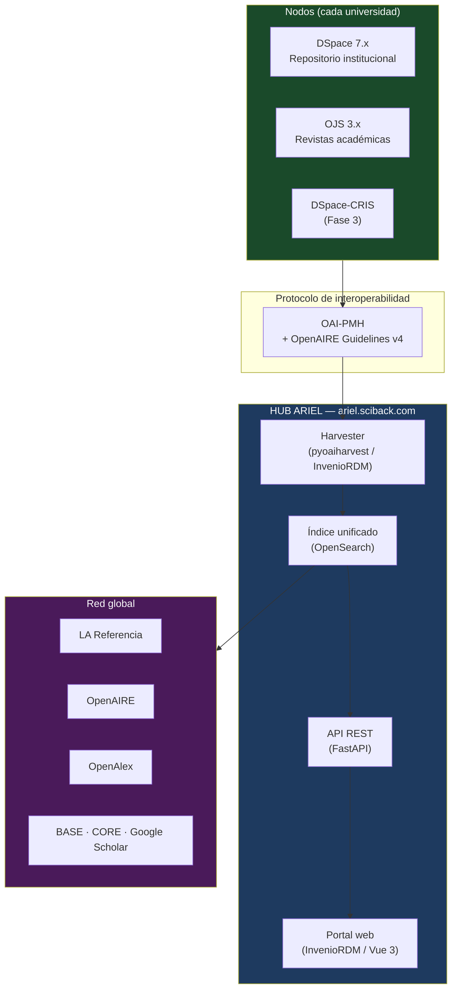
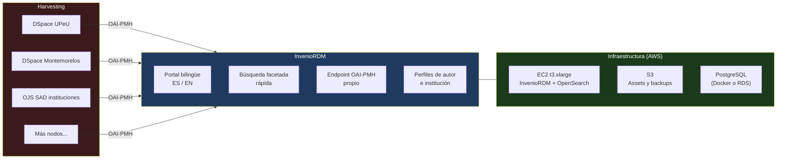
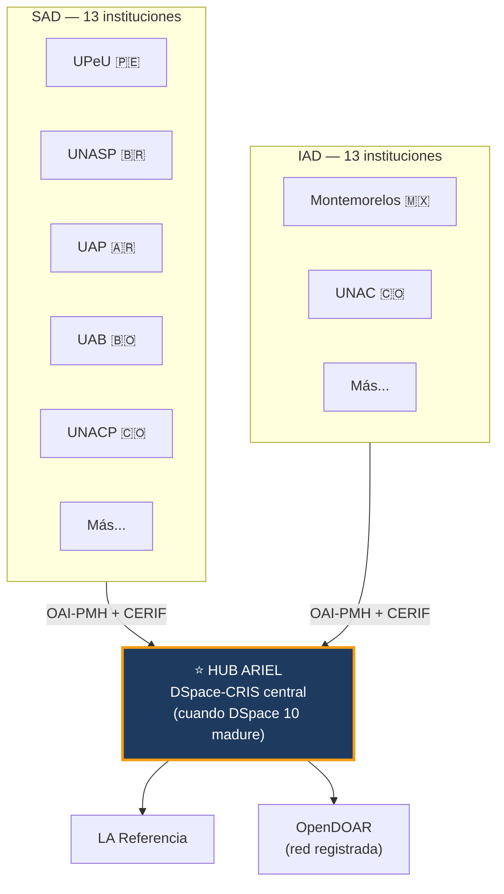
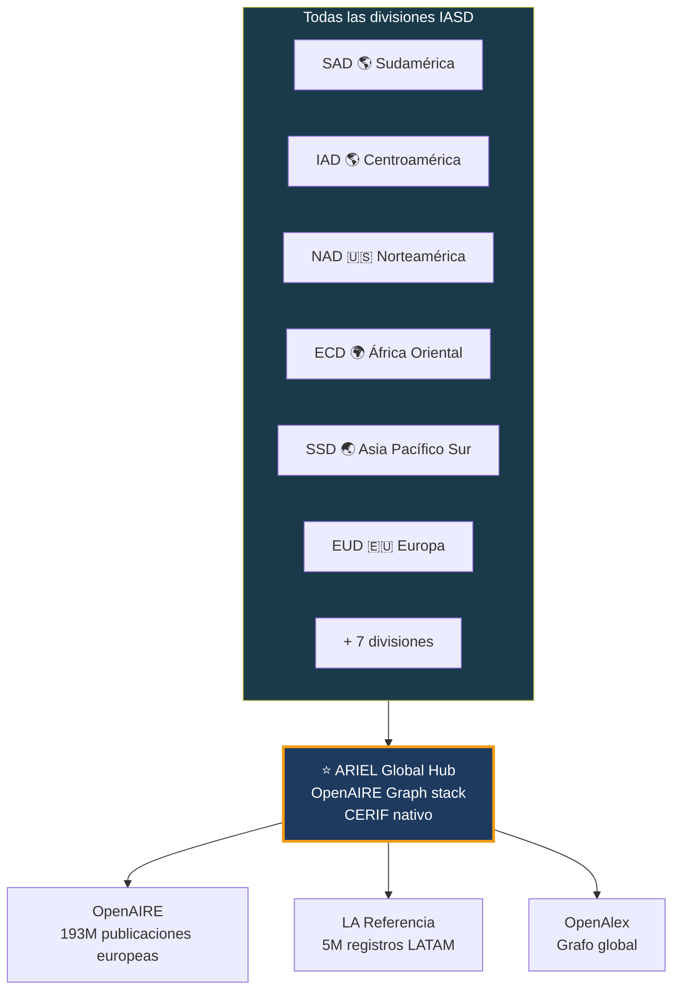
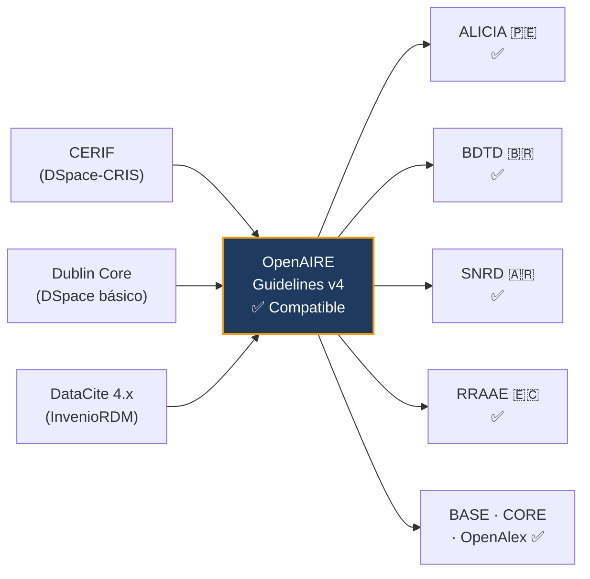

# Arquitectura Técnica

## Stack tecnológico recomendado por fase

---

### Visión general

---

## Fase 1 — Piloto SAD (2026)

### Tecnología recomendada: InvenioRDM

**Razón de elección — InvenioRDM:**

| Criterio | Detalle |
|---|---|
| Desarrollador | CERN — usado por Zenodo, TU Graz, KTH |
| UI | Moderna, similar a OpenAlex en limpieza |
| Harvesting | OAI-PMH nativo incorporado |
| Deploy | Docker Compose — stack conocido |
| CERIF | Extensible — mapeado Dublin Core → DataCite |
| Costo | Open source (MIT) |

---

## Fase 2 — SAD completa + IAD (2027)

### Upgrade a Hub DSpace-CRIS

**¿Por qué migrar a DSpace-CRIS en Fase 2?**

Cuando DSpace 10 fusione el core con DSpace-CRIS (4Science), cada nodo expondrá entidades CRIS completas: `Researcher → Project → Publication → Organization → Funding`. El hub adventista puede entonces construir el **grafo de conocimiento adventista**: quién investiga qué, con qué fondos, en qué institución, con qué impacto.

---

## Fase 3 — Escala global (2028+)

### OpenAIRE Graph como infraestructura base

---

## Schema de metadatos: compatibilidad simultánea

**El schema unificador es OpenAIRE Guidelines v4** — permite cumplir con todos los reguladores nacionales simultáneamente con mappings por país mínimos.

---

## Requisitos por nodo (cada universidad)

Para integrarse a ARIEL, una universidad adventista necesita:

- [x] **Repositorio activo** — DSpace 7.x recomendado
- [x] **OAI-PMH habilitado** — configuración por defecto en DSpace
- [x] **Subdominio propio** — `repositorio.universidad.edu.xx`
- [x] **Metadatos mínimos** — Dublin Core + OpenAIRE Guidelines v4
- [ ] **Registro en OpenDOAR** — proceso simple, voluntario
- [ ] **Acuerdo de participación ARIEL** — gobernanza y licencias

SciBack provee el despliegue y mantenimiento de cada nodo como servicio gestionado.
