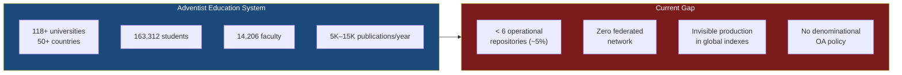
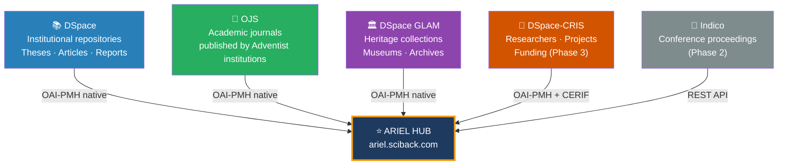
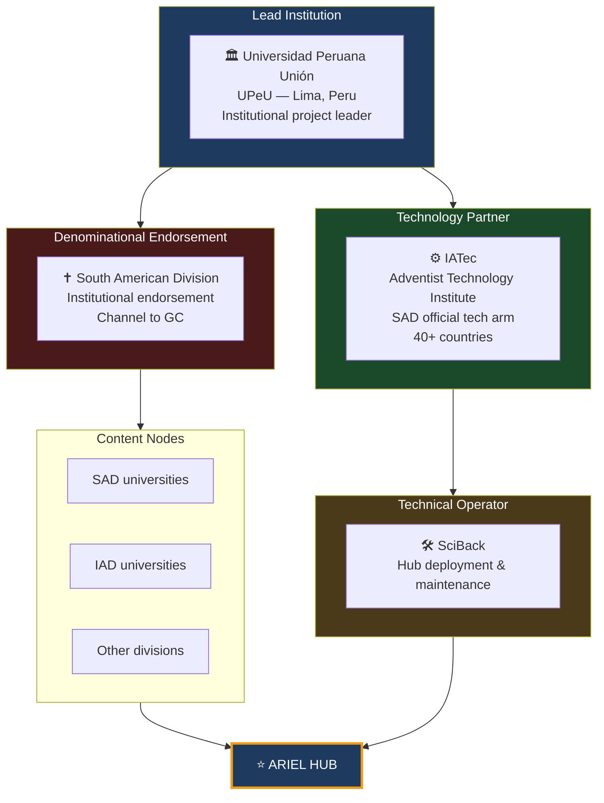

# Executive Proposal

## ARIEL — Adventist Repository for Institutional and Educational Literature

**Version:** 1.0 — March 2026
**Lead Institution:** Universidad Peruana Unión (UPeU)
**Strategic Partners:** IATec · South American Division (SAD)
**Initial Scope:** South American Division → global expansion

---

## 1. The foundation: Isaiah 29:18

!!! quote "The project name"
    In Biblical Hebrew, **Ariel** (אֲרִיאֵל) appears 6 times in the Old Testament with converging meanings: "Lion of God", "Altar/Hearth of God", symbolic name for Jerusalem. Isaiah 29 ends with this promise:

    > *"In that day the deaf will hear the words of the scroll, and out of gloom and darkness the eyes of the blind will see."* — Isaiah 29:18

    The instrument of restoration in that chapter is explicitly **the book** — knowledge made accessible. ARIEL is that book made into a network.

---

## 2. The problem

### 2.1 Massive scale, zero infrastructure

### 2.2 Systemic dependency on a single institution

Currently **10 of the 20 top users** of Andrews University's Digital Commons are other Adventist universities. The rest of the system has no own infrastructure and uses Andrews as a proxy.

!!! danger "Systemic risk"
    If Andrews University changes its policy or platform, the visibility of all global Adventist scientific production collapses. Production from Africa, Asia, and Latin America — in Spanish, Portuguese, French, Swahili, Bahasa — has no dedicated platform.

---

## 3. The solution: ARIEL

### 3.1 Platforms ARIEL aggregates

---

## 4. The 7 evidence-based arguments

=== "Scale"
    **118+ universities in 50+ countries** with 163,312 students and 14,206 faculty represent the world's second largest private education system — with zero digital infrastructure integrating their scientific production.

=== "Gap"
    Only **~6 institutions** have identifiable repositories out of 118+. Adoption rate **below 5%**, far below global average.

=== "Invisibility"
    Between **5,000 and 15,000 academic publications annually** in the Adventist system are inaccessible to Scopus, WoS, OpenAlex, and other Adventist researchers.

=== "Validated models"
    OpenAIRE (193M records), LA Referencia (5M records), CRRA/Atla, and BETH demonstrate that **federated denominational networks are technically feasible** and generate measurable value.

=== "Regulatory pressure"
    Peru (Law 30035), Colombia (Resolution 0777/2022), Brazil (CAPES OA) mandate interoperable repositories. ARIEL allows compliance with national regulations **and** global connectivity in one move.

=== "Denominational opportunity"
    The General Conference **has no open access policy**. ARIEL can catalyze the first formal Adventist policy, aligned with the Budapest, Berlin, and Bethesda Declarations.

=== "Rankings impact"
    Webometrics Transparent Ranking measures repositories directly. Without federated infrastructure, Adventist universities face **documented competitive disadvantage** in QS, THE, and Scimago.

---

## 5. Actors and roles

---

## 6. Next immediate steps

- [x] Name and target domain: **ariel.sciback.com**
- [x] Literature review — gap documented
- [x] Technical architecture defined
- [ ] Meeting with UPeU — present proposal
- [ ] Meeting with IATec — confirm technology role
- [ ] Formal SAD endorsement
- [ ] Inventory of SAD universities with active DSpace/OJS
- [ ] Apply WillPlan Mission Impact Fund (deadline May 1, 2027)
- [ ] Prepare IOI Fund concept note (2026–2027 call)
- [ ] Register ARIEL in OpenDOAR as a network
- [ ] Acquire ariel.sciback.com domain

[:fontawesome-solid-arrow-right: Funding](funding.md){ .md-button .md-button--primary }
[:fontawesome-solid-arrow-right: Architecture](architecture.md){ .md-button }
