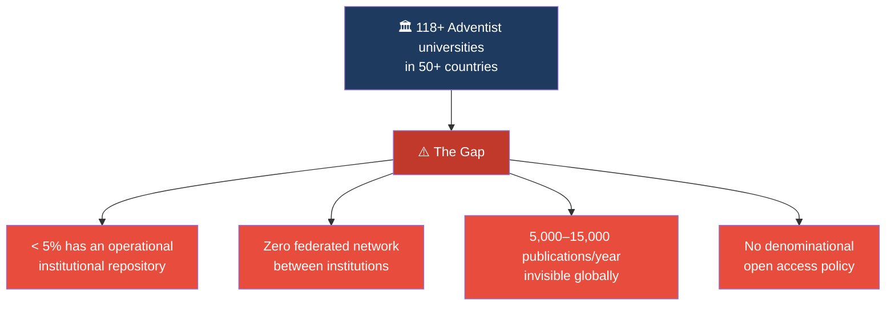
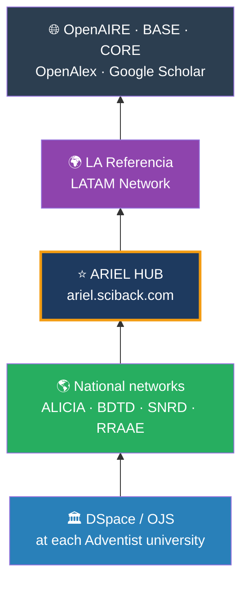
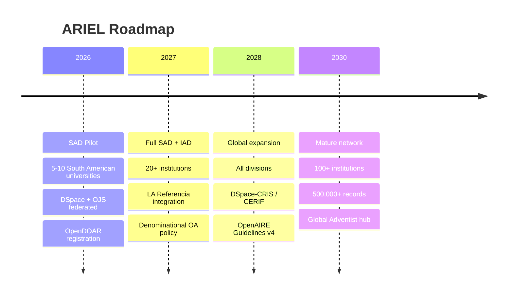

# ARIEL Network

## Adventist Repository for Institutional and Educational Literature

*The global scientific knowledge network of Seventh-day Adventist universities and institutions*

---

!!! quote "Isaiah 29:18"
    *"In that day the deaf will hear the words of the scroll, and out of gloom and darkness the eyes of the blind will see."*

    This verse is the heart of ARIEL. An academic repository whose purpose is to make accessible the knowledge that was previously sealed or invisible — **that is exactly this image**.

---

## What is ARIEL?

**ARIEL** is a federated network of institutional repositories from Seventh-day Adventist universities and research centers, starting with the **South American Division (SAD)** and expanding progressively to all world divisions.

It is the Adventist equivalent of what [OpenAIRE](https://openaire.eu) does for Europe or [LA Referencia](https://lareferencia.info) does for Latin America: **aggregate, unify, and give global visibility to Adventist scientific production**.

---

## The scale of the problem

---

## The solution: ARIEL aggregation pyramid

---

## Key numbers

-   :fontawesome-solid-university: **118+ universities**

    In 50+ countries — world's second largest private education system

-   :fontawesome-solid-users: **163,312 students**

    Tertiary level continuously generating theses and research

-   :fontawesome-solid-chalkboard-teacher: **14,206 faculty**

    Potential researchers and authors

-   :fontawesome-solid-file-alt: **5,000–15,000 publications/year**

    Conservative estimate — currently invisible globally

---

## Expansion roadmap

---

## Lead institution

**Universidad Peruana Unión (UPeU)** — Lima, Peru
South American Division, Seventh-day Adventist Church

[:fontawesome-solid-arrow-right: Executive Proposal](executive-proposal.md){ .md-button .md-button--primary }
[:fontawesome-solid-arrow-right: Technical Architecture](architecture.md){ .md-button }
