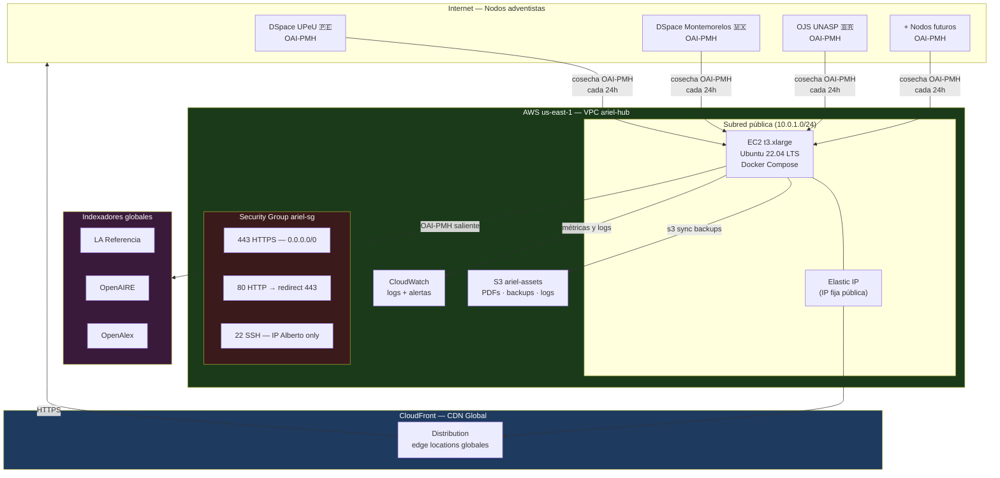
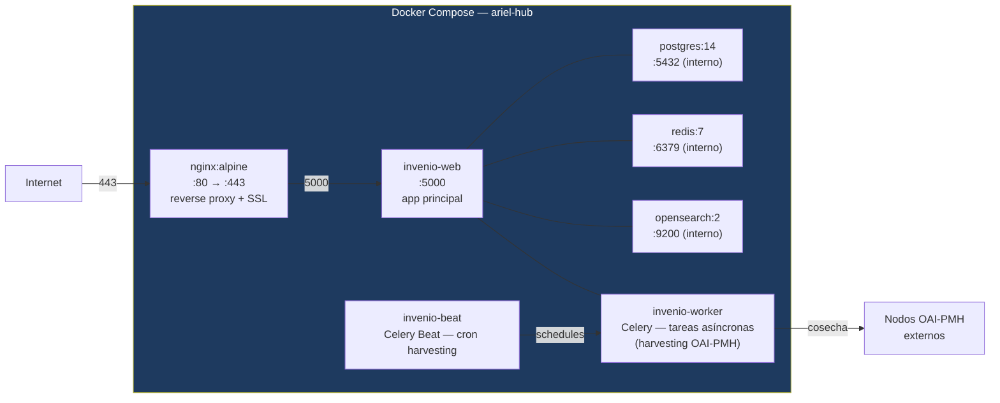
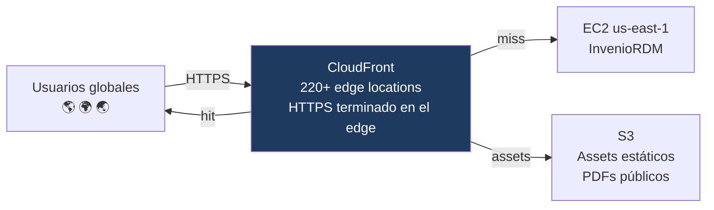
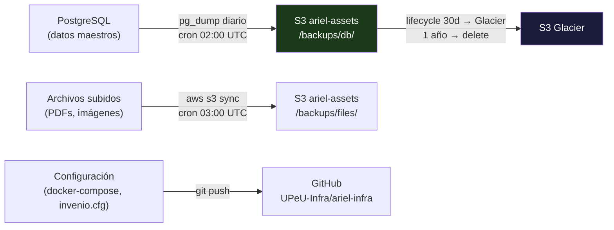

# Implementación AWS — HUB ARIEL

Canvas de infraestructura para el hub central: qué servicios AWS, en qué región, con qué topología, y a qué costo.

---

## Topología general



---

## Decisión de región: us-east-1

| Criterio | us-east-1 (Virginia) | sa-east-1 (São Paulo) |
|---|---|---|
| Costo EC2 t3.xlarge | **$130/mes** on-demand | $175/mes (+35%) |
| Peering OpenAIRE (EU) | Bueno | Regular |
| Peering LA Referencia (BR) | Bueno | Excelente |
| Latencia SAD promedio | ~120ms | ~40ms |
| CloudFront edge nodes | 220+ global | 220+ global |
| Soporte AMIs Ubuntu | ✅ | ✅ |

**Decisión: us-east-1 + CloudFront.**
CloudFront elimina la ventaja de latencia de sa-east-1 para los visitantes web. El costo extra de São Paulo no se justifica en Fase 1. CloudFront absorbe el tráfico web; las cosechas OAI-PMH (tráfico de baja frecuencia) toleran 120ms.

---

## Recursos AWS por fase

### Fase 1 — Piloto SAD (2026)

| Recurso | Tipo / Tamaño | Justificación |
|---|---|---|
| **EC2** | t3.xlarge (4 vCPU / 16 GB) | InvenioRDM requiere ≥8GB; 16GB da margen para OpenSearch + Celery |
| **EBS** | 200 GB gp3 | SO + Docker volumes: PG data, OpenSearch índices, InvenioRDM files |
| **Elastic IP** | 1 IP estática | DNS apunta aquí; no cambia entre reboots |
| **S3** | Bucket `ariel-assets` | PDFs de tesis (uploads), backups PostgreSQL, logs archivados |
| **CloudFront** | Distribution sobre EIP | SSL global, caché de assets estáticos, geo-acceleration |
| **Route 53** | Zona hosteada (si dominio propio) | Opcional en Fase 1 si se usa ariel.sciback.com |
| **CloudWatch** | Logs + alarmas básicas | Disco >80%, CPU >85%, instancia caída |
| **IAM** | Role `ariel-ec2-role` | Permisos mínimos: s3:PutObject, s3:GetObject al bucket propio |

### Fase 2 — SAD completa (2027)

Mismo stack, instancia escalada:

| Recurso | Upgrade | Razón |
|---|---|---|
| EC2 | t3.xlarge → **r6i.xlarge** (4 vCPU / 32 GB) | DSpace-CRIS + Solr requieren más RAM |
| EBS | 200 GB → **500 GB gp3** | Más nodos, más metadatos, más archivos |
| RDS PostgreSQL | Opcional — migrar desde Docker a RDS Multi-AZ | Alta disponibilidad si hay SLA formal |
| ALB | Application Load Balancer | Si se agregan réplicas o se separan workers |

### Fase 3 — Escala global (2028+)

| Recurso | Upgrade | Razón |
|---|---|---|
| EC2 | → **m6i.2xlarge** (8 vCPU / 32 GB) o ASG | OpenAIRE Graph Stack exige más computo |
| Multi-AZ | RDS Multi-AZ + EFS compartido | Alta disponibilidad real |
| Regiones | us-east-1 primaria + eu-west-1 réplica | Latencia Europa y cumplimiento GDPR |

---

## Stack Docker Compose — InvenioRDM Fase 1

```
ariel-hub/
├── docker-compose.yml        ← stack principal
├── docker-compose.override.yml ← overrides locales (no commiteado)
├── .env                      ← secretos (DB pass, SECRET_KEY, S3 keys)
├── nginx/
│   └── ariel.conf            ← reverse proxy + SSL
└── invenio.cfg               ← configuración InvenioRDM
```



**Puertos expuestos al host:** solo 80 y 443 (Nginx). El resto son inter-contenedor.

---

## Networking y seguridad

### VPC ariel-hub

```
VPC: 10.0.0.0/16
  Subred pública:  10.0.1.0/24  (EC2, Elastic IP)
  Subred privada:  10.0.2.0/24  (futura RDS si se migra)
```

### Security Group ariel-sg

| Puerto | Protocolo | Origen | Motivo |
|---|---|---|---|
| 443 | TCP | 0.0.0.0/0 | HTTPS — portal público |
| 80 | TCP | 0.0.0.0/0 | Redirect a HTTPS |
| 22 | TCP | IP Alberto (fija) | SSH admin |
| 22 | TCP | IP SciBack EC2 | SSH desde servidor SciBack |
| Todos | Todos | sg-ariel-sg self | Comunicación inter-instancias (Fase 2+) |

**Regla implícita:** todo lo demás bloqueado. PostgreSQL, Redis y OpenSearch nunca expuestos al exterior — solo inter-contenedor dentro de Docker.

### SSL

- **Fase 1:** Let's Encrypt (Certbot) en el EC2 — misma estrategia que el stack SciBack/UPeU
- **Fase 2+:** ACM (AWS Certificate Manager) con CloudFront — renovación automática, sin Certbot

---

## Accesibilidad global — CloudFront



**Qué cachea CloudFront:**
- Assets estáticos del portal (JS, CSS, imágenes): TTL 24h
- PDFs públicos en S3: TTL 7 días
- Páginas de búsqueda: TTL 0 (no cachear — resultados dinámicos)
- Endpoint OAI-PMH: TTL 0 (indexadores necesitan datos frescos)

**Beneficio clave:** un usuario en Kenia o Indonesia accede al portal ARIEL desde el edge node más cercano, no desde Virginia. La cosecha OAI-PMH (máquina a máquina) va directo al EC2.

---

## DNS y dominio

### Fase 1 — ariel.sciback.com (subdominio SciBack, disponible de inmediato)

```
ariel.sciback.com     → CloudFront distribution (CNAME)
oai.ariel.sciback.com → EC2 Elastic IP directo (sin CDN — para harvesters)
```

No requiere adquirir dominio nuevo — `sciback.com` ya es de Alberto. Listo para usar.

### Fase 2+ — Subdominio IASD (cuando haya endorsement)

```
ariel.adventist.org   → CloudFront (pendiente endorsement Conferencia General)
```

**Estrategia:** arrancar en `ariel.sciback.com` para Fase 1 (piloto SAD). Migrar a subdominio IASD cuando la División o la Conferencia General endorse el proyecto formalmente.

---

## Backup y recuperación

### Estrategia



| Dato | Frecuencia | Destino | Retención |
|---|---|---|---|
| PostgreSQL dump | Diario 02:00 UTC | S3 /backups/db/ | 30d Standard → 1 año Glacier |
| Archivos subidos | Diario 03:00 UTC | S3 /backups/files/ | 30d Standard |
| EBS snapshot | Semanal domingo | AWS Snapshots | 4 semanas |
| Config/infra | Cada cambio | GitHub | Indefinido |

**RTO objetivo Fase 1:** 2 horas (lanzar nueva EC2 + restaurar S3 backup)
**RPO objetivo Fase 1:** 24 horas (pérdida máxima = 1 día de cosechas)

---

## Costo estimado mensual

### Fase 1 — us-east-1 (2026)

| Servicio | On-demand | Reserved 1yr (no upfront) |
|---|---|---|
| EC2 t3.xlarge | $133 | **$67** |
| EBS 200 GB gp3 | $16 | $16 |
| S3 (50 GB + requests) | $2 | $2 |
| Elastic IP | $0 (asociada) | $0 |
| CloudFront (100 GB transfer) | $9 | $9 |
| CloudWatch (logs básicos) | $3 | $3 |
| Route 53 (1 zona) | $1 | $1 |
| **Total mensual** | **~$164** | **~$98** |

**Costo anual Fase 1:** ~$1,200 (reserved) — entra perfectamente como línea de presupuesto en la solicitud WillPlan ($30K–$100K).

### Comparativa por fase

| Fase | Año | Costo/mes estimado | Notas |
|---|---|---|---|
| Fase 1 | 2026 | **$98–$164** | t3.xlarge, Docker Compose |
| Fase 2 | 2027 | **$250–$350** | r6i.xlarge + RDS opcional |
| Fase 3 | 2028+ | **$600–$900** | Multi-región, ASG |

---

## Checklist de despliegue — Fase 1

### Pre-despliegue
- [ ] Adquirir dominio `ariel.sciback.com` (Namecheap / Route 53)
- [ ] Crear cuenta AWS dedicada `ariel-hub` (separar de cuentas SciBack/UPeU)
- [ ] Configurar IAM: usuario `ariel-deploy`, role `ariel-ec2-role`
- [ ] Crear bucket S3 `ariel-assets` con versionado activado
- [ ] Crear VPC `ariel-hub`, subred pública, Internet Gateway
- [ ] Crear Security Group `ariel-sg` con reglas definidas arriba

### Instancia
- [ ] Lanzar EC2 t3.xlarge, Ubuntu 22.04 LTS, AMI oficial
- [ ] Asignar Elastic IP
- [ ] Asignar instance profile con role `ariel-ec2-role`
- [ ] Agregar al `~/.ssh/config` como host `ariel-hub`
- [ ] Instalar Docker + Docker Compose v2

### Stack InvenioRDM
- [ ] Clonar `github.com/UPeU-Infra/ariel-infra` en EC2
- [ ] Configurar `.env` con secretos (no en git)
- [ ] `docker compose up -d`
- [ ] `invenio db init && invenio db create`
- [ ] `invenio index init`
- [ ] Configurar Nginx + Certbot para `ariel.sciback.com`
- [ ] Verificar endpoint OAI-PMH: `https://ariel.sciback.com/oai2d?verb=Identify`

### Harvesting
- [ ] Registrar primer nodo: DSpace UPeU
- [ ] Ejecutar cosecha manual — verificar registros importados
- [ ] Configurar Celery Beat: cosecha automática cada 24h
- [ ] Verificar búsqueda funcional en portal

### CloudFront y DNS
- [ ] Crear distribución CloudFront apuntando al EC2
- [ ] Configurar certificado SSL en ACM (o usar el de Certbot)
- [ ] Actualizar DNS: `ariel.sciback.com → CloudFront`
- [ ] `oai.ariel.sciback.com → Elastic IP` (directo, sin CDN)
- [ ] Verificar tiempos de respuesta desde distintas regiones

### Monitoreo
- [ ] CloudWatch alarm: disco >80%
- [ ] CloudWatch alarm: CPU >85% por 5 min
- [ ] CloudWatch alarm: status check falla
- [ ] SNS topic → email Alberto para alertas

---

## Repo de infraestructura

El código de infraestructura (docker-compose, nginx config, scripts de backup) vive en un repo separado:

```
github.com/UPeU-Infra/ariel-infra   (privado)
├── docker-compose.yml
├── docker-compose.prod.yml
├── nginx/
│   └── ariel.conf
├── scripts/
│   ├── 01-install-docker.sh
│   ├── 02-setup-invenio.sh
│   ├── 03-setup-ssl.sh
│   └── 04-setup-backups.sh
└── .env.example                    ← template sin secretos
```

Separado del repo `ariel` (documentación/sitio web) para mantener la infra versionada independientemente.
