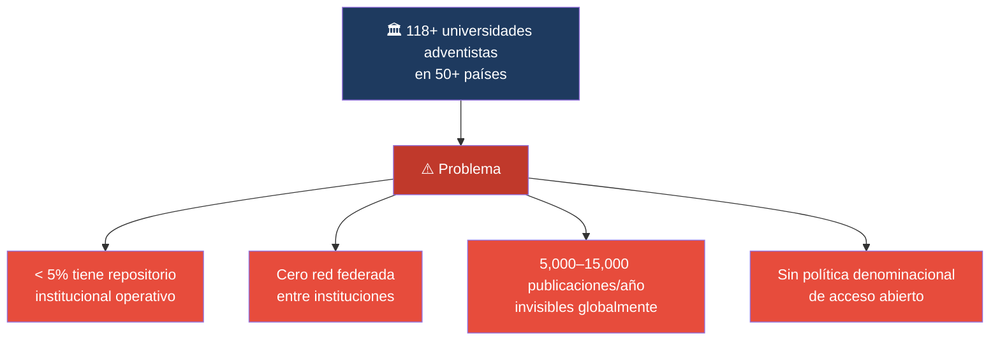
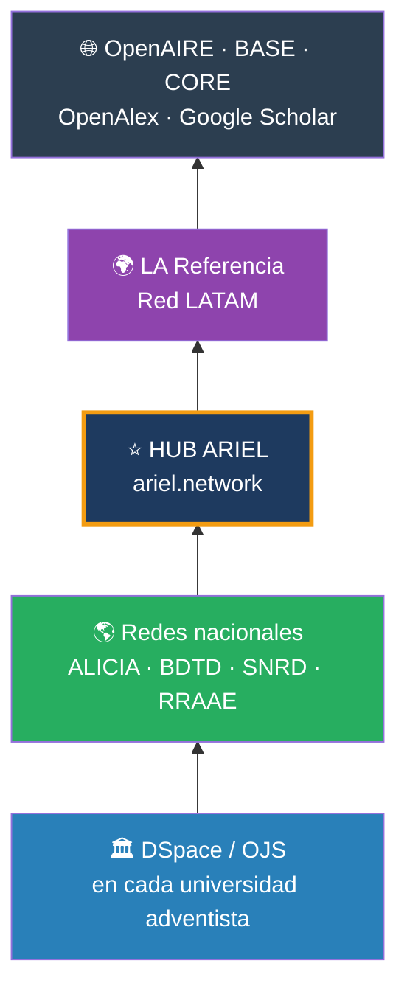
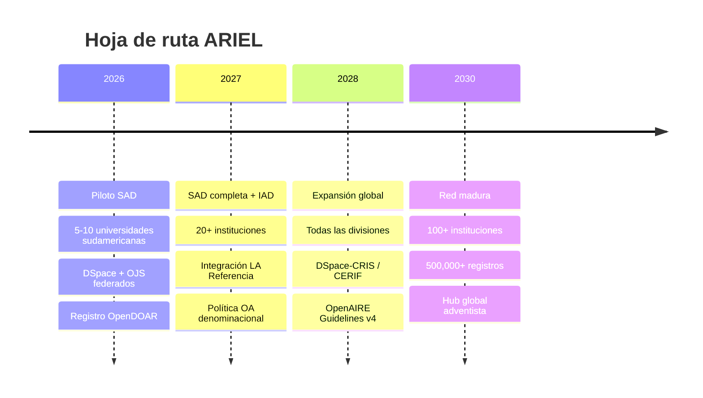

# ARIEL

## Adventist Repository for Institutional and Educational Literature

*Red global de repositorios científicos de las universidades e institutos de la Iglesia Adventista del Séptimo Día*

> **ARIEL** es un nombre propio — no se traduce. En español puede leerse como *"Repositorio Adventista de Investigación y Educación en Literatura"*, aunque el significado varía según el idioma de cada región. Como ocurre con OpenAIRE o ALICIA, el acrónimo es universal.

---

!!! quote "Isaías 29:18"
    *"En aquel día los sordos oirán las palabras del libro, y los ojos de los ciegos verán desde la oscuridad y las tinieblas."*

    Este versículo es el corazón de ARIEL. Un repositorio académico cuya función es hacer accesible el conocimiento que antes estaba sellado o invisible — **es exactamente esa imagen**.

---

## ¿Qué es ARIEL?

**ARIEL** es una red federada de repositorios institucionales de las universidades y centros de investigación de la Iglesia Adventista del Séptimo Día, iniciando con la **División Sudamericana (SAD)** y expandiéndose progresivamente a todas las divisiones del mundo.

Es el equivalente adventista de lo que hace [OpenAIRE](https://openaire.eu) para Europa o [LA Referencia](https://lareferencia.info) para América Latina: **agregar, unificar y dar visibilidad global a la producción científica adventista**.

---

## El problema que resuelve

---

## La solución: pirámide de agregación ARIEL

---

## Escala del sistema educativo adventista

-   :fontawesome-solid-university: **118+ universidades**

    En 50+ países — segundo sistema educativo privado del mundo

-   :fontawesome-solid-users: **163,312 estudiantes**

    Nivel terciario generando tesis e investigación continuamente

-   :fontawesome-solid-chalkboard-teacher: **14,206 docentes**

    Potenciales investigadores y autores

-   :fontawesome-solid-file-alt: **5,000–15,000 publicaciones/año**

    Estimación conservadora — actualmente invisibles

---

## Fases de expansión

---

## Institución promotora

**Universidad Peruana Unión (UPeU)** — Lima, Perú
División Sudamericana de la Iglesia Adventista del Séptimo Día

[:fontawesome-solid-arrow-right: Ver Propuesta Ejecutiva](propuesta-ejecutiva.md){ .md-button .md-button--primary }
[:fontawesome-solid-arrow-right: Arquitectura Técnica](arquitectura.md){ .md-button }
