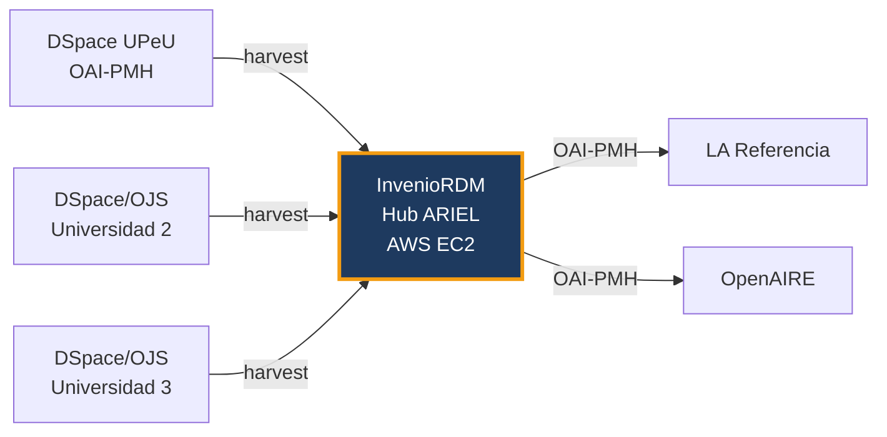
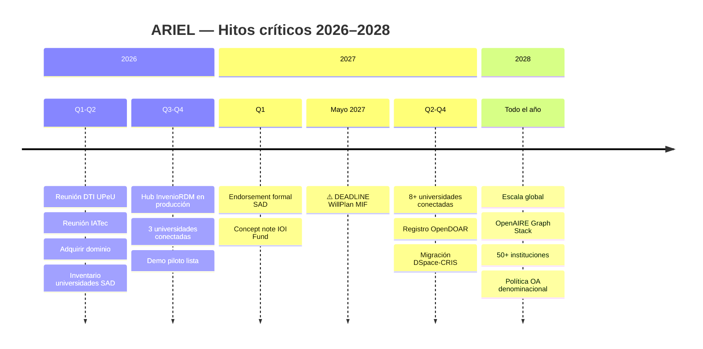

# Plan Operativo ARIEL 2026–2028

**Versión:** 1.0 — Marzo 2026
**Uso:** Interno — Alberto Sánchez
**Horizonte:** 3 años (4 fases)
**Hito crítico:** WillPlan MIF — deadline 1 mayo 2027

---

## Resumen ejecutivo

Este plan traduce la propuesta ejecutiva de ARIEL en actividades concretas, responsables y fechas. El objetivo es tener un hub piloto operativo antes del deadline WillPlan (mayo 2027), con al menos 3 universidades conectadas y un endorsement institucional formal de la División Sudamericana.

**Lógica del plan:**

```
Fase 0 → Validación institucional (Q1–Q2 2026)
Fase 1 → Hub piloto técnico (Q3–Q4 2026)
Fase 2 → Escala + financiamiento (2027)
Fase 3 → Consolidación global (2028+)
```

---

## FASE 0 — Validación Institucional

**Período:** Abril – Junio 2026
**Objetivo:** Asegurar los endorsements mínimos para operar y financiar el proyecto.

| # | Actividad | Responsable | Fecha objetivo | Estado |
|---|-----------|-------------|---------------|--------|
| 0.1 | Reunión con Director DTI UPeU — presentar propuesta ARIEL | Alberto | Abril 2026 | ⬜ Pendiente |
| 0.2 | Obtener carta de endorsement institucional UPeU | Alberto + DTI | Mayo 2026 | ⬜ Pendiente |
| 0.3 | Reunión con contacto IATec Perú — confirmar rol tecnológico | Alberto | Mayo 2026 | ⬜ Pendiente |
| 0.4 | Reunión con contacto SAD — presentar propuesta a División Sudamericana | Alberto | Junio 2026 | ⬜ Pendiente |
| 0.5 | Adquirir dominio (evaluar subdominio IASD vs ariel.academy) | Alberto | Abril 2026 | ⬜ Pendiente |
| 0.6 | Inventario: universidades SAD con DSpace/OJS activos | Alberto + IATec | Junio 2026 | ⬜ Pendiente |
| 0.7 | Definir modelo de gobernanza provisional ARIEL | Alberto | Junio 2026 | ⬜ Pendiente |

!!! warning "Dependencias críticas"
    Las actividades 0.1 y 0.3 son prerequisito para todo lo demás. Sin endorsement UPeU no se puede aplicar a WillPlan. Sin confirmación IATec no hay socio tecnológico formal.

### Entregables Fase 0
- [ ] Carta de endorsement UPeU
- [ ] Acuerdo de intención con IATec (email o MOU informal)
- [ ] Inventario inicial de universidades SAD (mínimo 10 instituciones mapeadas)
- [ ] Dominio adquirido y apuntando al sitio GitHub Pages actual

---

## FASE 1 — Hub Piloto Técnico

**Período:** Julio – Diciembre 2026
**Objetivo:** Desplegar InvenioRDM funcional con mínimo 3 universidades conectadas vía OAI-PMH.

| # | Actividad | Responsable | Fecha objetivo | Estado |
|---|-----------|-------------|---------------|--------|
| 1.1 | Provisionar instancia AWS para hub ARIEL (EC2 + dominio) | Alberto/SciBack | Julio 2026 | ⬜ Pendiente |
| 1.2 | Desplegar InvenioRDM en Docker Compose (producción) | Alberto/SciBack | Agosto 2026 | ⬜ Pendiente |
| 1.3 | Configurar harvesting OAI-PMH desde DSpace UPeU | Alberto | Agosto 2026 | ⬜ Pendiente |
| 1.4 | Configurar harvesting OAI-PMH desde segunda universidad piloto | Alberto + contacto local | Septiembre 2026 | ⬜ Pendiente |
| 1.5 | Configurar harvesting OAI-PMH desde tercera universidad piloto | Alberto + contacto local | Octubre 2026 | ⬜ Pendiente |
| 1.6 | Validar normalización de metadatos (OpenAIRE Guidelines v4) | Alberto | Octubre 2026 | ⬜ Pendiente |
| 1.7 | Documentar protocolo de onboarding para nuevas universidades | Alberto | Noviembre 2026 | ⬜ Pendiente |
| 1.8 | Prueba de exposición OAI-PMH del hub hacia LA Referencia | Alberto | Noviembre 2026 | ⬜ Pendiente |
| 1.9 | Demo interna — presentar piloto a DTI UPeU e IATec | Alberto | Diciembre 2026 | ⬜ Pendiente |

### Stack técnico Fase 1



### Entregables Fase 1
- [ ] Hub InvenioRDM en producción con URL pública
- [ ] 3 universidades conectadas con registros visibles
- [ ] Protocolo de onboarding documentado (guía técnica)
- [ ] Demo grabada para usar en presentaciones de financiamiento

---

## FASE 2 — Escala y Financiamiento

**Período:** Enero – Diciembre 2027
**Objetivo:** Asegurar financiamiento externo y escalar a SAD completa. Deadline crítico: 1 mayo 2027 (WillPlan).

| # | Actividad | Responsable | Fecha objetivo | Estado |
|---|-----------|-------------|---------------|--------|
| 2.1 | Preparar aplicación WillPlan MIF (presupuesto, narrativa, evidencia) | Alberto + UPeU | Marzo 2027 | ⬜ Pendiente |
| 2.2 | **Enviar aplicación WillPlan MIF** | UPeU (Alberto apoya) | **1 mayo 2027** | ⬜ Pendiente |
| 2.3 | Preparar concept note IOI Fund (convocatoria 2026–2027) | Alberto | Q1 2027 | ⬜ Pendiente |
| 2.4 | Obtener endorsement formal División Sudamericana | Alberto + SAD | Q1 2027 | ⬜ Pendiente |
| 2.5 | Conectar 5 universidades SAD adicionales | Alberto + IATec | Q2 2027 | ⬜ Pendiente |
| 2.6 | Registrar ARIEL en OpenDOAR como red | Alberto | Q2 2027 | ⬜ Pendiente |
| 2.7 | Migrar/ampliar hub a DSpace-CRIS (cuando DSpace 10 madure) | Alberto/SciBack | Q3–Q4 2027 | ⬜ Pendiente |
| 2.8 | Presentar ARIEL en congreso/evento denominacional (si hay oportunidad) | Alberto | 2027 | ⬜ Pendiente |
| 2.9 | Iniciar conversaciones con División Interamericana (IAD) | Alberto | Q4 2027 | ⬜ Pendiente |

!!! danger "Hito no negociable"
    La aplicación WillPlan (2.2) debe enviarse antes del **1 mayo 2027**. Preparar materiales con 2 meses de anticipación mínimo (actividad 2.1 → marzo 2027).

### Entregables Fase 2
- [ ] Aplicación WillPlan MIF enviada (con evidencia del piloto Fase 1)
- [ ] Concept note IOI Fund redactada
- [ ] Endorsement formal SAD (carta o resolución)
- [ ] 8+ universidades conectadas al hub
- [ ] ARIEL registrado en OpenDOAR

---

## FASE 3 — Consolidación Global

**Período:** 2028+
**Objetivo:** Escala continental, infraestructura sostenible, reconocimiento global.

| # | Actividad | Responsable | Fecha objetivo | Estado |
|---|-----------|-------------|---------------|--------|
| 3.1 | Migrar hub a OpenAIRE Graph Stack | Alberto/SciBack + IATec | 2028 | ⬜ Pendiente |
| 3.2 | Expandir a División Interamericana (IAD) | Alberto + IATec | 2028 | ⬜ Pendiente |
| 3.3 | Expandir a Norteamérica (NAD) y África Oriental (ECD) | IATec + socios locales | 2028–2029 | ⬜ Pendiente |
| 3.4 | Implementar modelo SCOSS (membresías institucionales) | Alberto/SciBack | 2028 | ⬜ Pendiente |
| 3.5 | Aplicar Mellon Foundation Higher Learning Program | UPeU + ARIEL | Ciclo 2027 | ⬜ Pendiente |
| 3.6 | Proponer política formal OA a Conferencia General | Alberto + SAD | 2028–2029 | ⬜ Pendiente |
| 3.7 | Alcanzar 50+ instituciones conectadas | IATec + redes locales | 2029 | ⬜ Pendiente |

### Entregables Fase 3
- [ ] 50+ instituciones en 3+ divisiones
- [ ] Sostenibilidad financiera vía SCOSS u otro modelo recurrente
- [ ] Primera política OA denominacional formal
- [ ] Integración con OpenAIRE y LA Referencia consolidada

---

## Matriz de riesgos

| Riesgo | Probabilidad | Impacto | Mitigación |
|--------|-------------|---------|-----------|
| DTI UPeU no da endorsement institucional | Baja | Alto | Relación personal Alberto–Director DTI |
| IATec no confirma rol tecnológico | Media | Alto | SciBack puede operar el hub sin IATec en Fase 1 |
| WillPlan no aprueba la aplicación | Media | Alto | IOI Fund como alternativa; piloto reduce el riesgo |
| Universidad piloto no tiene DSpace activo | Media | Medio | UPeU ya tiene DSpace activo — empezar con 1 es suficiente |
| Dominio IASD no disponible | Baja | Bajo | ariel.academy como respaldo ($13/año) |
| DSpace 10 no madura para Fase 2 | Media | Bajo | InvenioRDM escala bien — no hay urgencia de migrar |
| Falta de capacidad técnica en universidades nodo | Alta | Medio | Protocolo de onboarding (entregable 1.7) + soporte IATec |

---

## KPIs por fase

| Indicador | Línea base (2026) | Meta Fase 1 | Meta Fase 2 | Meta Fase 3 |
|-----------|-----------------|-------------|-------------|-------------|
| Instituciones conectadas | 0 | 3 | 8+ | 50+ |
| Registros agregados | 0 | 5,000+ | 50,000+ | 500,000+ |
| Divisiones cubiertas | 0 | 1 (SAD) | 2 (SAD+IAD) | 5+ |
| Fondos asegurados | $0 | $0 | $30K–$100K | $1.5M+ |
| Endorsements institucionales | 0 | 1 (UPeU) | 3 (UPeU+IATec+SAD) | GC |

---

## Vista de hitos críticos



---

[:fontawesome-solid-arrow-right: Ver Propuesta Ejecutiva](propuesta-ejecutiva.md){ .md-button .md-button--primary }
[:fontawesome-solid-arrow-right: Ver Financiamiento](financiamiento.md){ .md-button }
[:fontawesome-solid-arrow-right: Ver Arquitectura](arquitectura.md){ .md-button }
