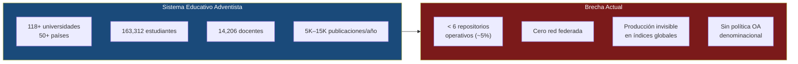
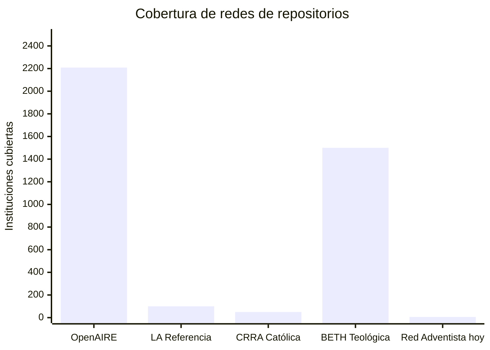
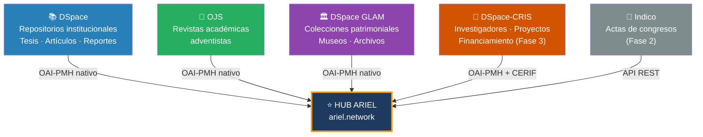
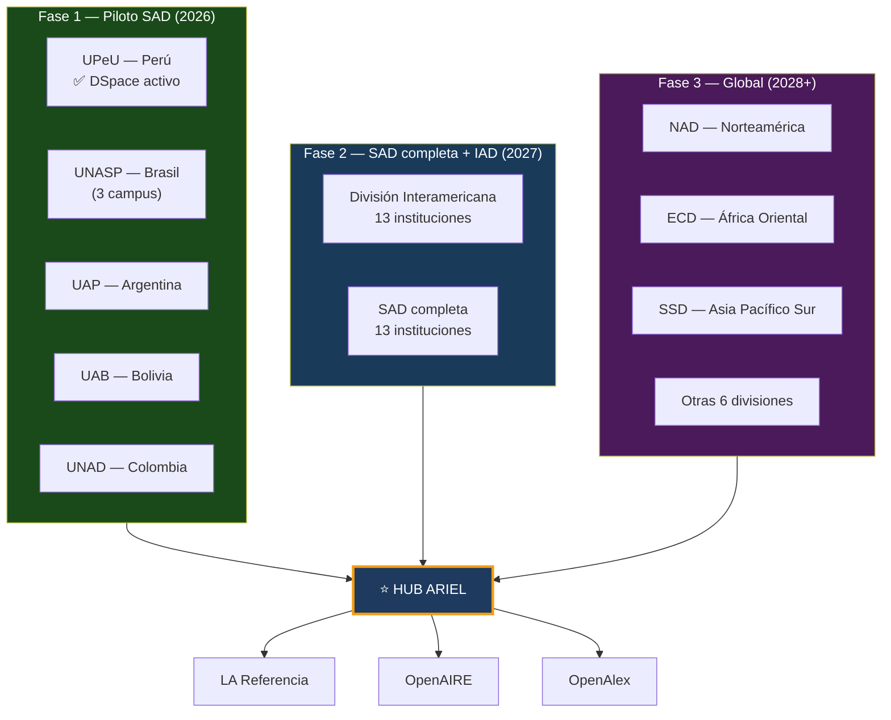
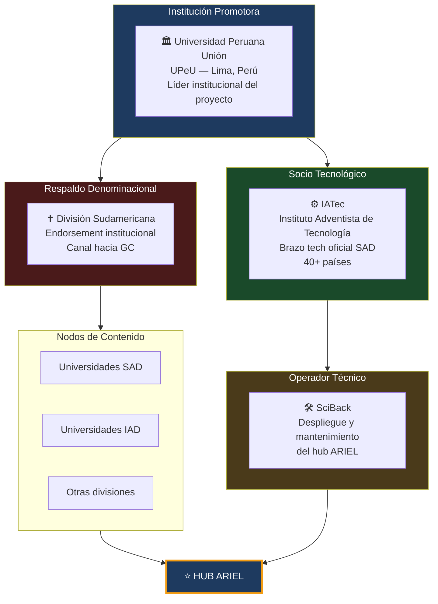

# Propuesta Ejecutiva

## ARIEL — Adventist Repository for Institutional and Educational Literature

!!! note "Sobre el nombre"
    **ARIEL** es un nombre propio que no se traduce. El acrónimo en inglés es la forma oficial para todas las regiones, igual que OpenAIRE o ALICIA. En cada idioma el significado puede interpretarse localmente, pero el nombre del proyecto es siempre **ARIEL**.

**Versión:** 1.0 — Marzo 2026
**Institución proponente:** Universidad Peruana Unión (UPeU)
**Socios estratégicos:** IATec · División Sudamericana (SAD)
**Alcance inicial:** División Sudamericana → expansión global

---

## 1. El fundamento: Isaías 29:18

!!! quote "El nombre del proyecto"
    En hebreo bíblico, **Ariel** (אֲרִיאֵל) aparece 6 veces en el Antiguo Testamento con significados que convergen: "León de Dios", "Altar/Hogar de Dios", nombre simbólico de Jerusalén. En Isaías 29, el capítulo termina con esta promesa:

    > *"En aquel día los sordos oirán las palabras del libro, y los ojos de los ciegos verán desde la oscuridad y las tinieblas."* — Isaías 29:18

    El instrumento de restauración en ese capítulo es explícitamente **el libro** — el conocimiento hecho accesible. ARIEL es ese libro hecho red.

---

## 2. El problema

### 2.1 Una escala sin infraestructura

### 2.2 La dependencia de una sola institución

Actualmente, **10 de los 20 principales usuarios** del repositorio de Andrews University son otras universidades adventistas. El resto del sistema no tiene infraestructura propia y usa Andrews como proxy.

!!! danger "Riesgo sistémico"
    Si Andrews University cambia su política o plataforma, la visibilidad de toda la producción científica adventista global colapsa. La producción de África, Asia y Latinoamérica — en español, portugués, francés, swahili, bahasa — no tiene plataforma propia.

### 2.3 Comparación con redes equivalentes

---

## 3. La solución: ARIEL

### 3.1 Definición

**ARIEL** es una plataforma de agregación y descubrimiento de la producción científica de las universidades e institutos de la Iglesia Adventista del Séptimo Día, operando como hub federado interoperable con las principales redes académicas globales.

### 3.2 Plataformas que ARIEL agrega

!!! info "¿Qué no entra en ARIEL?"
    **Koha** (catálogo de biblioteca física) queda fuera del alcance. ARIEL agrega *producción científica* — lo que los investigadores crean. Koha gestiona lo que las bibliotecas compran o suscriben. Son capas distintas del ecosistema.

---

## 4. Arquitectura de expansión

---

## 5. Los 7 argumentos que justifican ARIEL

=== "Escala"
    **118+ universidades en 50+ países** con 163,312 estudiantes y 14,206 docentes constituyen el segundo sistema educativo privado mundial. No existe infraestructura digital que integre su producción científica.

=== "Brecha"
    Solo **~6 instituciones** tienen repositorios identificables sobre un universo de 118+. Tasa de adopción **menor al 5%**, muy inferior al promedio global.

=== "Invisibilidad"
    Entre **5,000 y 15,000 publicaciones académicas anuales** en el sistema adventista son inaccesibles para Scopus, WoS, OpenAlex y otros investigadores adventistas.

=== "Modelos validados"
    OpenAIRE (193M registros), LA Referencia (5M registros), CRRA/Atla y BETH demuestran que las **redes federadas denominacionales son técnicamente factibles** y generan valor medible.

=== "Presión regulatoria"
    Perú (Ley 30035), Colombia (Resolución 0777/2022), Brasil (CAPES OA) obligan a repositorios interoperables. ARIEL permite cumplir la normativa nacional **y** estar conectadas globalmente en un solo movimiento.

=== "Oportunidad denominacional"
    La Conferencia General **no tiene política de acceso abierto**. ARIEL puede ser el catalizador para la primera política formal adventista, alineada con las Declaraciones de Budapest, Berlín y Bethesda.

=== "Rankings"
    Webometrics Transparent Ranking mide repositorios directamente. Sin infraestructura federada, las universidades adventistas están en **desventaja competitiva documentada** en QS, THE y Scimago.

---

## 6. Actores y roles

---

## 7. Próximos pasos inmediatos

- [x] Nombre y dominio objetivo: **ariel.network**
- [x] Revisión de literatura — brecha documentada
- [x] Arquitectura técnica definida
- [ ] Reunión con DTI UPeU — presentar propuesta
- [ ] Reunión con IATec — confirmar rol tecnológico
- [ ] Endorsement formal de la División Sudamericana
- [ ] Inventario de universidades SAD con DSpace/OJS activos
- [ ] Aplicar WillPlan Mission Impact Fund (deadline 1 mayo 2027)
- [ ] Preparar concept note para IOI Fund (convocatoria 2026–2027)
- [ ] Registrar ARIEL en OpenDOAR como red
- [ ] Adquirir dominio ariel.network

[:fontawesome-solid-arrow-right: Ver Financiamiento](financiamiento.md){ .md-button .md-button--primary }
[:fontawesome-solid-arrow-right: Ver Arquitectura Técnica](arquitectura.md){ .md-button }
